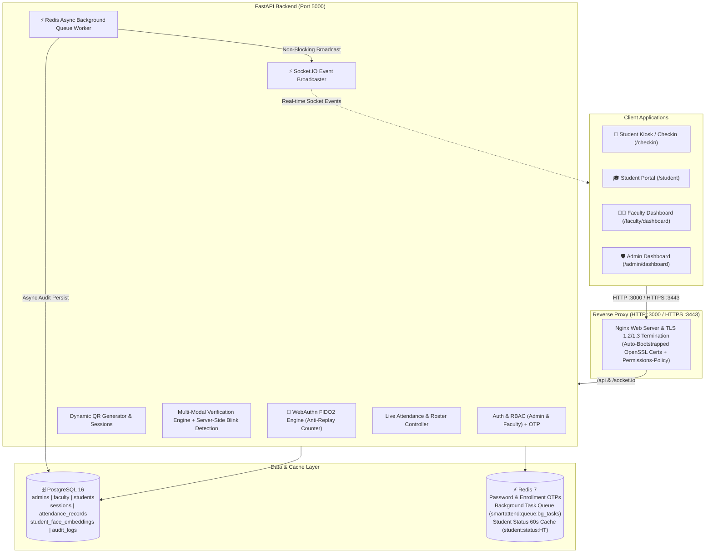
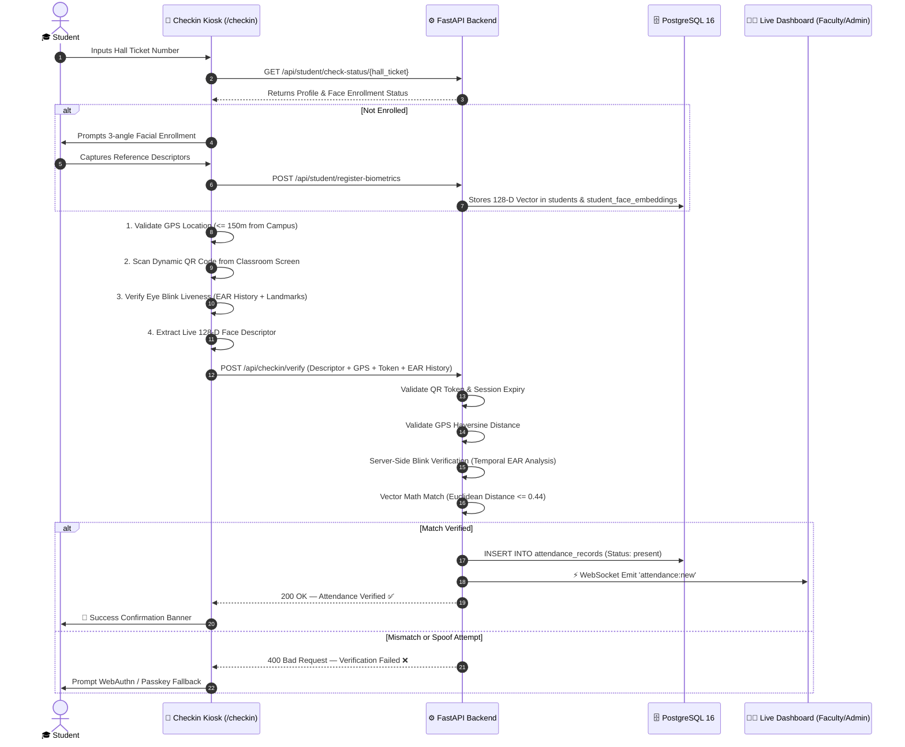
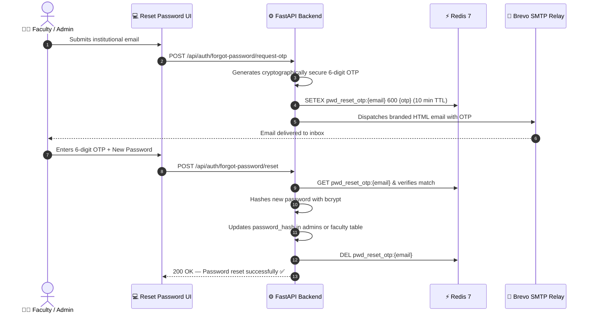

# 🎓 Smart Attend — Intelligent Multi-Modal Attendance & Biometric System

[](https://fastapi.tiangolo.com)
[](https://reactjs.org/)
[](https://vitejs.dev/)
[](https://www.typescriptlang.org/)
[](https://tailwindcss.com/)
[](https://www.postgresql.org/)
[](https://redis.io/)
[](https://www.docker.com/)
[](https://github.com/features/actions)
[](FIXES_APPLIED.md)

**Smart Attend** is an enterprise-ready, multi-modal attendance automation platform engineered for academic institutions. It provides zero-proxy attendance enforcement using **128-dimensional Facial Recognition AI**, **Real-Time Eye Blink Liveness Detection**, **Campus GPS Geofencing**, **Time-Bound Dynamic QR Tokens**, and **WebAuthn / Passkey Biometrics**.

The system runs on a **self-hosted PostgreSQL 16 database** with **Redis 7** for secure OTP password recovery and session caching, using **Brevo SMTP** for institutional communications.

---

## 📑 Table of Contents

- [✨ Key Features](#-key-features)
- [🛠️ Technology Stack](#️-technology-stack)
- [🏗️ System Architecture](#️-system-architecture)
- [👥 User Roles & Permissions](#-user-roles--permissions)
- [🔄 Core Workflows](#-core-workflows)
- [🖥️ UI & Route Map](#️-ui--route-map)
- [📁 Project Structure](#-project-structure)
- [🚀 Quickstart & Setup](#-quickstart--setup)
  - [1. Prerequisites](#1-prerequisites)
  - [2. Environment Configuration](#2-environment-configuration)
  - [3. Running with Docker Compose (Recommended)](#3-running-with-docker-compose-recommended)
  - [4. Running Locally for Development](#4-running-locally-for-development)
  - [5. Database Setup & Seeding](#5-database-setup--seeding)
- [🛡️ Anti-Proxy & Security Architecture](#️-anti-proxy--security-architecture)
- [� Security Enhancements](#-security-enhancements)
- [�📡 API Endpoints Reference](#-api-endpoints-reference)
- [🤝 Contributing & License](#-contributing--license)

---

## ✨ Key Features

- 👤 **128-D Facial Recognition AI:** Client-side 68-landmark detection and 128-D vector extraction via `face-api.js` (SSD MobileNet v1), verified on backend using high-performance NumPy Euclidean distance calculations ($\text{threshold} \le 0.44$).
- 👁️ **Active Eye Blink Liveness:** Computes real-time Eye Aspect Ratio (EAR) across video stream frames to defeat static photos, printed portraits, and screen video playbacks.
- 📍 **GPS Campus Geofencing:** Real-time client coordinate validation against the campus center (SBIT Khammam: $17.2472^\circ\text{N}, 80.1514^\circ\text{E}$) using the Haversine formula (configurable radius, default $150\text{m}$).
- 🔄 **Dynamic Rotating QR Sessions:** Faculty broadcast dynamic, time-limited QR codes that automatically re-encrypt every 30 seconds to prevent screenshot sharing.
- 🔐 **WebAuthn / Passkey Biometric Fallback:** Hardware-backed biometric authentication (Fingerprint / TouchID / Windows Hello) for students requiring secondary verification.
- ⚡ **Real-Time WebSocket Stream:** Instantaneous bi-directional updates via Socket.IO pushing check-ins to Live Attendance Rosters on Faculty and Admin dashboards.
- 🏢 **Multi-Tier Role Separation:** Independent relational tables for `admins`, `faculty`, and `students` ensuring clean database isolation.
- 📧 **Redis-Backed OTP & Brevo SMTP:** Redis-cached 6-digit verification codes (10-minute expiry, rate-limited) dispatched via Brevo SMTP relay for self-service password recovery.
- 📊 **Live Roster & Excel Export:** Instant inline status toggles (Present / Late / Absent), bulk actions, search filters, and one-click `.xlsx` report downloads.

---

## 🛠️ Technology Stack

### **Frontend**
- **Framework:** [React 18](https://react.dev/) + [TypeScript 5](https://www.typescriptlang.org/)
- **Build Tool:** [Vite 5](https://vitejs.dev/)
- **Styling:** [Tailwind CSS 3.4](https://tailwindcss.com/) with dark/light mode and custom theme tokens
- **Vision Models:** `face-api.js` (SSD MobileNet v1, FaceLandmark68Net, FaceRecognitionNet)
- **Networking:** `socket.io-client`, Axios, Fetch API
- **Icons & Visuals:** `lucide-react`, `canvas-confetti`, `xlsx`

### **Backend**
- **Framework:** [FastAPI](https://fastapi.tiangolo.com/) (Python 3.11+)
- **ASGI Server:** [Uvicorn](https://www.uvicorn.org/)
- **ORM & DB:** [SQLAlchemy](https://www.sqlalchemy.org/) + [PostgreSQL 16](https://www.postgresql.org/)
- **Hardware Biometrics:** [WebAuthn FIDO2](https://github.com/duo-labs/py_webauthn) (`webauthn==2.1.0` + `cbor2`) with monotonic signature counter anti-replay checks
- **Background Queue & Caching:** Redis 7 Task Queue (`smartattend:queue:bg_tasks`) for non-blocking DB audit logging & Socket.IO fanout, plus 60-second status caching
- **Email Delivery:** [Brevo SMTP Relay](https://www.brevo.com/) via Python standard library `smtplib`
- **Realtime:** `python-socketio` Async ASGI server
- **Security:** `passlib` (bcrypt password hashing), `pyjwt` (HS256 access tokens), httpOnly cookies for production
- **Liveness Detection:** Server-side ML blink detection with temporal EAR analysis
- **Vector Math:** [NumPy](https://numpy.org/) for vector distance calculations

### **Infrastructure**
- **Docker Compose:** Orchestration of 4 isolated containers (`frontend`, `backend`, `postgres`, `redis`)
- **Web Server & TLS Reverse Proxy:** Multi-stage Nginx container with HTTP (port 3000) and HTTPS (port 3443 with TLS 1.2/1.3 and automatic OpenSSL self-signed certificate generation), reverse-proxying `/api` and `/socket.io` with modern `Permissions-Policy`

---

## 🏗️ System Architecture



---

## 👥 User Roles & Permissions

| Role | Target Users | Authentication | Key Capabilities |
| :--- | :--- | :--- | :--- |
| **Admin** | System Administrators | Email + Password (JWT) | Complete institutional control: add/remove other admins, add/remove faculty, register students individually or via Excel bulk upload, configure geofence radius & center, view institutional logs & analytics. |
| **Faculty** | Professors & Teachers | Email + Password (JWT) | Broadcast dynamic QR sessions, view real-time class attendance rosters, override student attendance inline, trigger bulk status marks, export `.xlsx` class records. |
| **Student** | Enrolled Students | Multi-Modal Face AI / Passkey | Check in via classroom QR scan + facial verification, view personal attendance statistics, review attended sessions. **Students do not have passwords** — access is authenticated through physical biometrics. |

---

## 🔄 Core Workflows

### 1. Student Check-in Sequence


### 2. Password Reset with Redis OTP


---

## 🖥️ UI & Route Map

```
/
├── /checkin                     👉 Public Student Kiosk (Face AI + Liveness + QR Scanner + GPS)
├── /student/dashboard           👉 Student Personal Portal (Attendance history & statistics)
├── /login                       👉 Staff Portal (Admins & Faculty)
├── /reset-password              👉 Self-Service OTP Password Recovery
│
├── 🛡️ Admin Space (Role: admin)
│   ├── /admin/dashboard         👉 Institutional Stats, Geofence Controller, Live Roster, User Modals
│   ├── /admin/approvals         👉 Student & Faculty Verification Requests
│   └── /admin/manual-attendance 👉 Staff Manual Attendance Marker
│
├── 👨‍🏫 Faculty Space (Role: faculty, admin)
│   ├── /faculty/dashboard       👉 Broadcast Dynamic QR Sessions, Real-Time Classroom Roster
│   └── /faculty/manual-attendance 👉 Class Attendance Overrides
│
└── 📊 Shared Analytics (Role: faculty, admin)
    ├── /attendance/live         👉 Fullscreen Institutional Live Attendance Wall
    ├── /analytics               👉 Department Breakdown & Trend Charts
    └── /reports                 👉 Excel (.xlsx), CSV, and PDF Report Export Center
```

---

## 📁 Project Structure

```
smartattend-ai/
├── 📂 backend/
│   ├── 📂 app/
│   │   ├── 📂 dependencies/     # Auth Guards (get_current_user, require_role)
│   │   ├── 📂 models/           # SQLAlchemy DB Models & Pydantic Schemas
│   │   ├── 📂 routes/           # Modular REST API Endpoints
│   │   │   ├── admin.py         # Institutional stats & geofence configuration
│   │   │   ├── attendance.py    # Live records, date queries, toggle, and bulk marks
│   │   │   ├── auth.py          # Admin/faculty login, user CRUD, OTP password reset & enrollment OTP
│   │   │   ├── checkin.py       # Multi-modal kiosk verification & biometrics with server-side blink detection
│   │   │   ├── health.py        # Service & database health checks
│   │   │   ├── qr_session.py    # Dynamic rotating QR sessions
│   │   │   └── student_face.py  # Face vector enrollment & cache
│   │   ├── 📂 services/         # Face recognition vector calculation service
│   │   ├── 📂 utils/            # Redis client, Brevo email service, security, geofence, blink detection, face matcher
│   │   ├── config.py            # Environment validation & security guards
│   │   ├── database.py          # SQLAlchemy engine & session maker with admin bootstrap
│   │   ├── main.py              # FastAPI app & Socket.IO server setup
│   │   └── seed.py              # Non-destructive bootstrap seeder
│   ├── 📂 db/
│   │   ├── postgresql_schema.sql # Complete PostgreSQL 16 schema with tables & triggers
│   │   └── README.md            # Database schema documentation
│   ├── Dockerfile               # Backend Python container definition
│   ├── requirements.txt         # Python dependencies
│   └── requirements-dev.txt     # Development dependencies (pytest, coverage, bandit)
│
├── 📂 frontend/
│   ├── 📂 public/
│   │   ├── 📂 assets/logos/     # Institutional logos & branding
│   │   └── 📂 models/           # Pre-trained face-api.js weights & manifests
│   ├── 📂 src/
│   │   ├── 📂 components/       # Modals, Live Attendance Roster, QR, Face Camera, Admin/Faculty modals
│   │   ├── 📂 context/          # AuthContext (httpOnly cookie-based), AttendanceContext, ThemeContext
│   │   ├── 📂 face/             # Face API model loader
│   │   ├── 📂 pages/            # Views (Admin, Faculty, Student, Kiosk, Analytics)
│   │   ├── App.tsx              # Role-based route definitions & layout shell
│   │   └── index.css            # Tailwind design tokens & styles
│   ├── Dockerfile               # Multi-stage production Nginx container build
│   ├── nginx.conf               # Production Nginx proxy configuration
│   └── package.json             # Frontend dependencies & scripts
│
├── 📂 edge/
│   ├── app.py                   # Edge face recognition service (optional for offline deployments)
│   └── README.md                # Edge service setup guide
│
├── 📂 .github/
│   └── 📂 workflows/
│       └── ci.yml               # GitHub Actions CI/CD pipeline (tests, security scan, build)
│
├── docker-compose.yml           # Unified multi-container orchestration
├── FIXES_APPLIED.md             # Security fixes and production readiness documentation
├── API_DOCUMENTATION.md         # Detailed API endpoint documentation
└── README.md                    # System documentation
```

---

## 🚀 Quickstart & Setup

### 1. Prerequisites
- **Docker & Docker Compose** (Recommended): [Get Docker](https://www.docker.com/)
- *Alternatively for local development without Docker:*
  - Node.js 18+ & npm
  - Python 3.11+
  - PostgreSQL 16
  - Redis 7

---

### 2. Environment Configuration

The system uses a single `.env` file located in the `backend/` directory for local development.

Copy the example file to create your local `.env`:
```bash
cp backend/.env.example backend/.env
```

Edit `backend/.env` with your secure values. For local development, the defaults are safe to use as-is. **Do not use the default secrets in production.**

**Required Environment Variables:**

| Variable | Description | Default (Dev Only) |
| :--- | :--- | :--- |
| `NODE_ENV` | Environment mode (`development` or `production`) | `development` |
| `POSTGRES_USER` | PostgreSQL username | `postgres` |
| `POSTGRES_PASSWORD` | PostgreSQL password | `postgrespassword` |
| `POSTGRES_DB` | PostgreSQL database name | `smartattend` |
| `POSTGRES_HOST` | PostgreSQL host | `postgres` (Docker) / `localhost` (local) |
| `POSTGRES_PORT` | PostgreSQL port | `5432` |
| `REDIS_URL` | Redis connection URL | `redis://redis:6379/0` |
| `JWT_SECRET` | JWT signing secret (32+ chars recommended) | `smartattend-secure-qr-jwt-key-2026` |
| `EDGE_API_KEY` | Edge device API key (32+ chars recommended) | `smartattend-edge-default-key` |
| `ADMIN_EMAIL` | Bootstrap admin email | `admin@sbit.ac.in` |
| `ADMIN_PASSWORD` | Bootstrap admin password (min 8 chars) | `Admin@123!` |
| `BREVO_SMTP_SERVER` | Brevo SMTP server | `smtp-relay.brevo.com` |
| `BREVO_SMTP_PORT` | Brevo SMTP port | `587` |
| `BREVO_SMTP_LOGIN` | Brevo SMTP login | (your Brevo login) |
| `BREVO_SMTP_KEY` | Brevo SMTP API key | (your Brevo key) |
| `BREVO_FROM_EMAIL` | From email address | (your institutional email) |
| `BREVO_FROM_NAME` | From name | `Smart Attend — SBIT` |
| `CORS_ORIGIN` | CORS allowed origins | `http://localhost:3000` |

**Production Security Guards:**
When `NODE_ENV=production`, the backend will fail to start if:
- Default database passwords are used (`postgrespassword`, `localdevpassword123`)
- Default `JWT_SECRET` is used
- Default `EDGE_API_KEY` is used
- Default `ADMIN_EMAIL` or `ADMIN_PASSWORD` is used

This prevents accidental deployment with insecure defaults.

---

### 3. Running with Docker Compose (Recommended)

The fastest and most reliable way to run the entire stack is via Docker Compose. Because the `.env` file is located inside `backend/`, you **must** pass `--env-file backend/.env` to all Docker Compose commands.

**Single command to build and launch the entire stack:**
```bash
docker compose --env-file backend/.env up -d --build
```

This starts 4 isolated, auto-restarting containers with healthchecks:
| Container | Port | Description |
| :--- | :--- | :--- |
| `smartattend-frontend` | `http://localhost:3000`<br>`https://localhost:3443` | Production React App (Nginx Reverse Proxy & TLS 1.2/1.3 Termination) |
| `smartattend-backend` | `http://localhost:5000` | FastAPI Backend + Redis Background Task Worker (Internal Network) |
| `smartattend-postgres` | `5432` | PostgreSQL 16 Database (Internal Network) |
| `smartattend-redis` | `6379` | Redis 7 Cache, Task Queue & OTP Store (Internal Network) |

> **Note on Database Resets:** If you modify `POSTGRES_PASSWORD` in your `.env` *after* the database volume has already been initialized, PostgreSQL will reject connections with the new password. To wipe existing data volumes and reinitialize, run: `docker compose down -v` followed by the build command above.

#### Essential Docker Commands

| Action | Command |
| :--- | :--- |
| **Build & Start All (Single Command)** | `docker compose --env-file backend/.env up -d --build` |
| **Start Stack (Without Rebuilding)** | `docker compose --env-file backend/.env up -d` |
| **Build & Start Backend Only** | `docker compose --env-file backend/.env up -d --build backend` |
| **Build & Start Frontend Only** | `docker compose --env-file backend/.env up -d --build frontend` |
| **Stop All Containers** | `docker compose down` |
| **Stop & Wipe All Persistent Volumes** | `docker compose down -v` |
| **Check Container Status & Health** | `docker compose ps` |
| **Follow All Container Logs** | `docker compose logs -f` |
| **Follow Backend Logs Only** | `docker compose logs -f backend` |
| **Follow Frontend Logs Only** | `docker compose logs -f frontend` |
| **Execute Shell / Command in Backend** | `docker compose exec backend <cmd>` |
| **Execute PostgreSQL psql CLI** | `docker compose exec postgres psql -U postgres -d smartattend` |

---

### 4. Running Locally (Without Docker)

If you prefer to run the services individually without Docker Compose:

**1. Start Backend:**
```bash
cd backend
python -m venv .venv
source .venv/bin/activate  # (On Windows: .venv\Scripts\activate)
pip install -r requirements.txt
uvicorn app.main:app --host 0.0.0.0 --port 5000 --reload
```

**2. Start Frontend (Node.js):**
```bash
cd frontend
npm install
npm run dev
```

**3. Build & Run Frontend Standalone (Using Docker Nginx):**
If you want to test the production build of the frontend in isolation:
```bash
cd frontend
docker build -t smartattend-frontend .
docker run -d -p 3000:80 smartattend-frontend
```

---

### 5. Production Deployment (Coolify / Docker)

Smart Attend is optimized for 1-click deployment on **Coolify** or any standard Docker VPS.

1. Connect your GitHub repository to Coolify.
2. Select **Docker Compose** as the build pack.
3. In the Coolify **Environment Variables** UI, you **must** set the following variables (do not use a `.env` file in Coolify):

   ```env
   NODE_ENV=production
   POSTGRES_PASSWORD=<generate: openssl rand -hex 32>
   JWT_SECRET=<generate: python -c "import secrets; print(secrets.token_hex(32))">
   EDGE_API_KEY=<generate: python -c "import secrets; print(secrets.token_urlsafe(32))">
   ADMIN_EMAIL=admin@sbit.ac.in
   ADMIN_PASSWORD=<your-secure-admin-password, min 8 chars>
   ```

   *Note: When `NODE_ENV=production`, the backend enforces strict startup guards and will raise a `RuntimeError` if default database passwords (`postgrespassword`, `localdevpassword123`), default `JWT_SECRET`, or default `EDGE_API_KEY` are detected.*

4. Click **Deploy**. Coolify provisions SSL certificates, runs the PostgreSQL and Redis containers internally, and routes traffic through Nginx on port `80`/`443`.

---

### 6. Database Setup & Seeding

The database schema initializes automatically on first Docker launch via [`backend/db/postgresql_schema.sql`](file:///d:/Projects/smartattend-ai/backend/db/postgresql_schema.sql).

If no administrators exist in the database, the system will **automatically bootstrap an initial admin account** using the `ADMIN_EMAIL` and `ADMIN_PASSWORD` environment variables on startup. Additional faculty and students can be enrolled through the admin dashboard or via Excel bulk upload.

---

## 🛡️ Anti-Proxy & Security Architecture

| Threat / Attack Vector | Defense Mechanism | Implementation Detail |
| :--- | :--- | :--- |
| **Photo / Display Screen Spoofing** | **Fail-Closed Server-Side ML Blink Detection** | Analyzes a sliding window of Eye Aspect Ratio (EAR) samples ($\ge 3$ samples required). Enforces open baseline ($\ge 0.18$), contraction dip ($\ge 0.022$), and eye reopening. Rejects flatline signals ($\text{std} < 0.005$) and anatomical anomalies. |
| **Off-Campus Remote Proxy** | **Strict Session GPS Geofencing** | Enforces Euclidean Haversine distance strictly against the session-specific radius ($\le 150\text{m}$). The legacy 5km campus relief clause has been removed to prevent off-site check-in bypass. |
| **QR Screenshot Relaying** | **Rotating Ephemeral Tokens** | Dynamic classroom QR tokens cycle periodically with cryptographic signatures and expiration. Verification strictly binds to the active session (no arbitrary session fallback). |
| **Unverified Biometric Claims** | **Removal of Client Flag Trust** | The check-in endpoint no longer honors unverified client-reported `biometricVerified: true` flags. Only genuine facial recognition with validated ML liveness grants attendance. |
| **Data Race / Incomplete Writes** | **Atomic Database Transactions** | Session bootstrap and attendance record insertions are executed within single transactional scopes with explicit rollback on `IntegrityError`. |
| **Attendance History Wipe** | **Session-Scoped Deletes** | All manual overrides, toggles, bulk actions, and kiosk captures delete existing records scoped strictly to `(session_id, hall_ticket_no)`. |
| **Biometric Descriptor Leakage** | **Zero-Vector Public Exposure** | Raw 128-D / 512-D face descriptors are stripped from public responses (`check-status`, `Student.to_dict()`, user queries). The client never receives raw biometric vectors. |
| **Brute Force & Flooding** | **SlowAPI Rate Limiting** | Strict rate limits applied to check-in (`5/min`), verification (`10/min`), login (`10/min`), and password reset OTP dispatch (`3/min`). |
| **Unauthenticated Read Access** | **Strict JWT RBAC** | All roster and history endpoints (`/api/attendance/records`, `/api/admin/geofence`) require verified JWT authentication via httpOnly cookies. |
| **Cryptographic RNG for OTP** | **Python `secrets` Module** | OTPs are generated using CSPRNG (`secrets.randbelow`) and cached in Redis with a 10-minute TTL. |
| **Default Credential Usage** | **Production Startup Guards** | Fails closed on boot if default credentials or passwords are used in production environments. |
| **JWT Token Theft (XSS)** | **httpOnly Cookie Authentication** | JWT tokens stored in httpOnly, secure, SameSite=lax cookies. JavaScript cannot access tokens, preventing XSS-based token theft. |

---

## 🔒 Security Enhancements

Smart Attend has undergone comprehensive security hardening addressing all critical attack surfaces:

### ✅ Production Security Hardening

#### 1. Server-Side ML Blink Liveness (Fail-Closed)
- **Temporal EAR Analysis**: Validates natural human blink dynamics on the backend via [`app.utils.blink_detection`](file:///d:/Projects/smartattend-ai/backend/app/utils/blink_detection.py).
- **Signal Processing Pipeline**:
  - Requires a minimum of 3 temporal EAR samples from the client sliding window.
  - Verifies resting open-eye baseline ($\text{EAR} \ge 0.18$).
  - Detects distinct contraction trough ($\text{dip\_depth} \ge 0.022$).
  - Confirms post-blink eye reopening.
  - **Static Spoof Defense**: Rejects flat signals ($\text{std} < 0.005$) and out-of-bounds physiological anomalies ($[0.02, 0.65]$).
  - **Zero Client Override**: Fails closed if telemetry is absent or validation fails.

#### 2. Strict Session-Bound Geofencing
- Haversine distance is checked strictly against `session_radius` ($\le 150\text{m}$).
- Removed the legacy `and campus_dist > 5000` condition that previously allowed students within 5km of campus to bypass the lecture radius.

#### 3. Strict Session Token Validation
- Check-in tokens strictly resolve to their corresponding active session.
- Removed fallback queries that previously assigned check-ins to arbitrary active sessions (`.order_by(created_at.desc()).first()`).

#### 4. Removal of Unverified Biometric Short-Circuit
- The legacy `payload.biometricVerified` code path (which granted $99\%$ confidence from an untrusted client boolean) has been removed.
- Attendance records record authoritative `server_blink_verified` status.

#### 5. Atomic Transactions & Direct Persistence
- Combined session auto-creation and attendance insertion into an atomic transaction with explicit rollback on `IntegrityError` (409 Conflict).
- Eliminated dangling in-memory references in favor of authoritative PostgreSQL queries for student records and live attendance feeds.

#### 6. httpOnly Cookie Authentication
- **JWT storage migrated** from localStorage to httpOnly, secure, SameSite=lax cookies.
- JavaScript cannot read tokens, mitigating XSS token theft.
- Includes `/api/auth/logout` endpoint to clear cookies server-side.

#### 7. True FIDO2 WebAuthn Server-Side Hardware Assertion
- **W3C WebAuthn Standards**: End-to-end attestation and assertion verification powered by `webauthn==2.1.0` and `cbor2`.
- **Anti-Replay Counter Checks**: Authenticator data flags (byte 32 `UP` & `UV`) and 4-byte big-endian signature counters validated against PostgreSQL (`biometric_sign_count`) to strictly prevent token replay and cloning attacks.
- **Single-Use Challenges**: Cryptographic challenges generated with 180s TTL in Redis and popped atomically on verification.

#### 8. TLS/HTTPS Reverse Proxy & Strict Transport Hardening
- **Dual-Mode Nginx Listener**: Serves HTTP on port `3000` and HTTPS on port `3443` with HTTP/2 and modern TLS 1.2/1.3 cipher suites.
- **Zero-Touch Certificate Bootstrap**: Automated 2048-bit RSA self-signed certificates generated on container startup with SANs (`localhost`, `127.0.0.1`, `0.0.0.0`).
- **Permissions-Policy**: Configured `camera=(self), geolocation=(self), publickey-credentials-get=*, publickey-credentials-create=*` for unrestricted WebAuthn & hardware support on mobile and desktop.

#### 9. High-Performance Redis Background Queue & Status Caching
- **Asynchronous Task Queue**: Decouples check-in endpoint latency by queueing database audit logs and WebSocket broadcasts to Redis (`smartattend:queue:bg_tasks`).
- **Student Status Caching**: 60-second Redis caching on `/api/student/check-status/{hall_ticket}` with automatic invalidation whenever attendance is recorded or biometrics are modified.

### 🛡️ Core Security Features

| Security Layer | Implementation | Status |
| :--- | :--- | :--- |
| **GPS Geofencing** | Haversine distance validation, strict session radius | ✅ Enforced |
| **Face Descriptor Protection** | Raw vectors stripped from public responses | ✅ Protected |
| **Session Token Validation** | Strict session match, no arbitrary fallback | ✅ Enforced |
| **Rate Limiting** | SlowAPI on critical endpoints (5–10/min) | ✅ Active |
| **Cryptographic OTP** | Python `secrets` module, Redis TTL | ✅ Implemented |
| **Production Guards** | Startup checks for default credentials | ✅ Active |
| **RBAC Enforcement** | JWT-based role verification via httpOnly cookies | ✅ Enforced |
| **Liveness Detection** | Server-side ML temporal EAR analysis (fail-closed) | ✅ Implemented |
| **JWT Storage** | httpOnly, secure, SameSite=lax cookies | ✅ Implemented |
| **Hardware Biometrics** | Server-side FIDO2 WebAuthn + Anti-replay signature counter | ✅ Enforced |
| **TLS/HTTPS** | Port 3443 with TLS 1.2/1.3 & automated certificate generation | ✅ Active |
| **Async Task Queue** | Redis background queue for audit logging & WebSocket fanout | ✅ Active |
| **Status Caching** | 60s Redis cache with auto-invalidation on attendance updates | ✅ Active |

### 🔐 Production Security Checklist

Before deploying to production, ensure:

- [ ] Set custom `JWT_SECRET` (minimum 32 characters)
- [ ] Set custom `EDGE_API_KEY` (minimum 32 characters)
- [ ] Set custom `POSTGRES_PASSWORD` (not default values)
- [ ] Set custom `ADMIN_EMAIL` and `ADMIN_PASSWORD`
- [ ] Configure Brevo SMTP credentials for OTP delivery
- [ ] Enable HTTPS/TLS (handled by Coolify or your reverse proxy)
- [ ] Review and update CORS origins to your domain
- [ ] Test OTP enrollment flow with your email provider
- [ ] Run CI/CD pipeline to ensure all tests pass


## 🤝 Contributing & License

1. Fork the project repository.
2. Create a feature branch (`git checkout -b feature/NewFeature`).
3. Commit your changes (`git commit -m 'Add NewFeature'`).
4. Push to your branch (`git push origin feature/NewFeature`).
5. Open a Pull Request.

Distributed under the **MIT License**.
